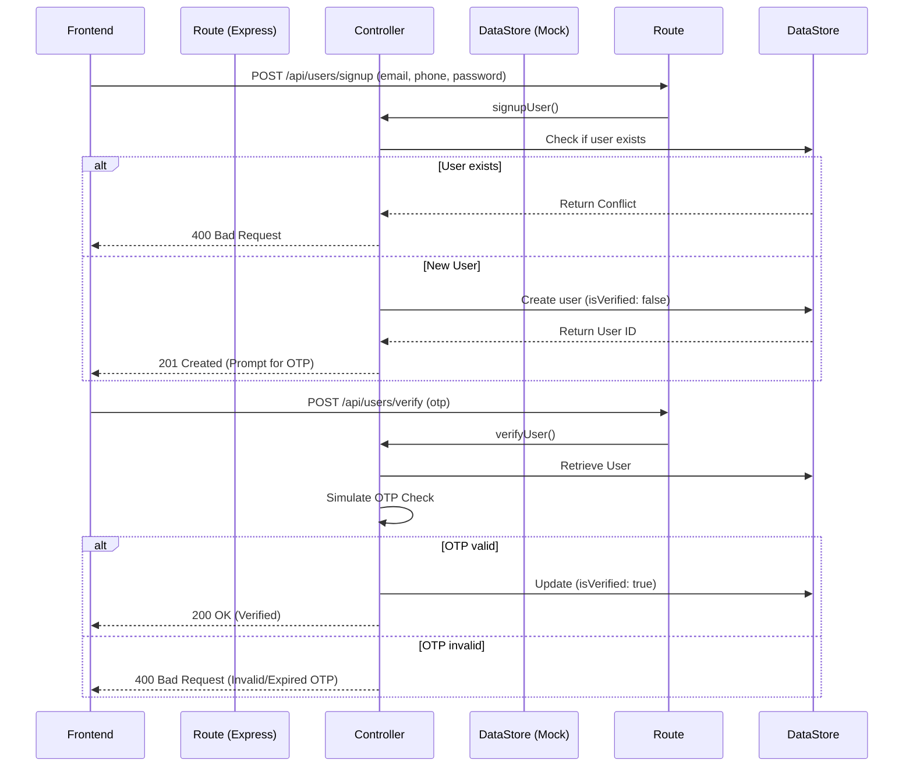
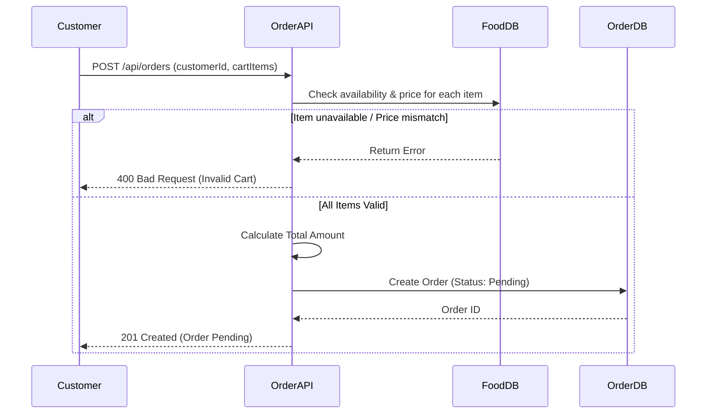
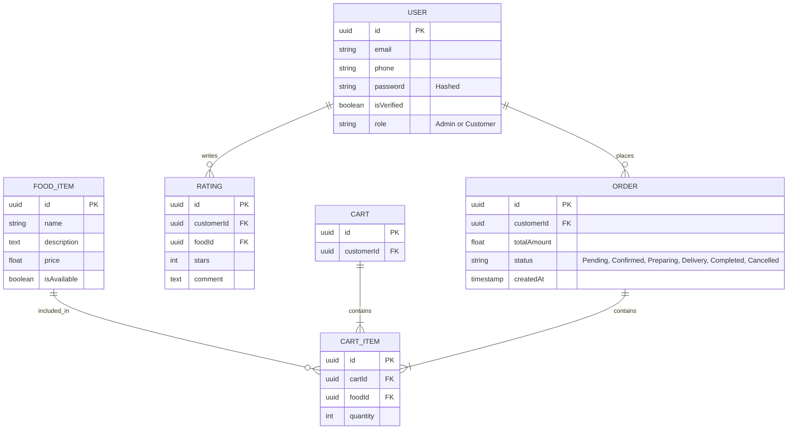

# Chuks Kitchen - Backend
A Backend API and System Design for the Chuks Kitchen food ordering platform.

## 1. System Overview
This project is a conceptually designed and partially implemented backend service for the Chuks Kitchen digitial food ordering platform. The system facilitates customer interactions such as registering for an account, browsing available food items, adding items to a cart, placing orders, and tracking order statuses. Behind the scenes, the API leverages Node.js (Express) with an in-memory data store for simplified testing and immediate usability.

## 2. Backend Flow Diagrams

### User Registration & Access Flow
This diagram illustrates the process of a new user signing up, potentially providing a referral code, and then verifying their account via an OTP.

### Ordering Flow Explanation
The ordering flow handles validating cart items against current database availability and prices before finalizing a pending order.

## 3. Data Modeling (ERD)

## 4. Edge Case Handling
- **User abandons signup midway:** In a real SQL database, unverified accounts might fall into a `cron` job cleanup script that prunes accounts unverified after 24 hours.
- **Invalid/Expired OTP or Referral Code:** Return standard 400 Bad Request errors prompting the user on the frontend to resend the code.
- **Duplicate Registration:** The system queries `email` and `phone` before insertion. `400 Bad Request` is thrown immediately if they exist.
- **Food becomes unavailable after adding to cart:** The `POST /api/orders` route strictly validates `isAvailable` status for *every* item in the request against the current internal state *before* assigning a total price and creating the order.

## 5. Assumptions
- **Authentication**: For the scope of this deliverable, JWT token generation, password hashing (bcrypt), and robust session states are omitted in favor of structural flow logic.
- **Datastore**: An in-memory data structure is used to allow reviewers to run the API without installing or configuring external databases (like MongoDB or PostgreSQL).
- **Payment Processing**: Assumed to be handled externally (e.g., Paystack/Flutterwave webhook), meaning the order is created as `Pending` until a hypothetical payment webhook transitions it to `Confirmed`.

## 6. Scalability Thoughts (100 -> 10,000+ Users)
As user traffic grows from 100 to 10,000+:
1. **Database Migration**: The in-memory store must be replaced with a relational DB (PostgreSQL) for transactional integrity (ACID) ensuring race conditions don't ruin food stock quantities, or MongoDB if menus change rapidly geographically.
2. **Caching**: Utilize Redis to cache the `GET /api/foods` route since the menu is read-heavy and rarely changes compared to order creation.
3. **Microservices / Background Workers**: Sending emails (OTPs) and processing order status updates should be detached from the main Express event loop using message queues (RabbitMQ or AWS SQS) to prevent blocking incoming user requests.
