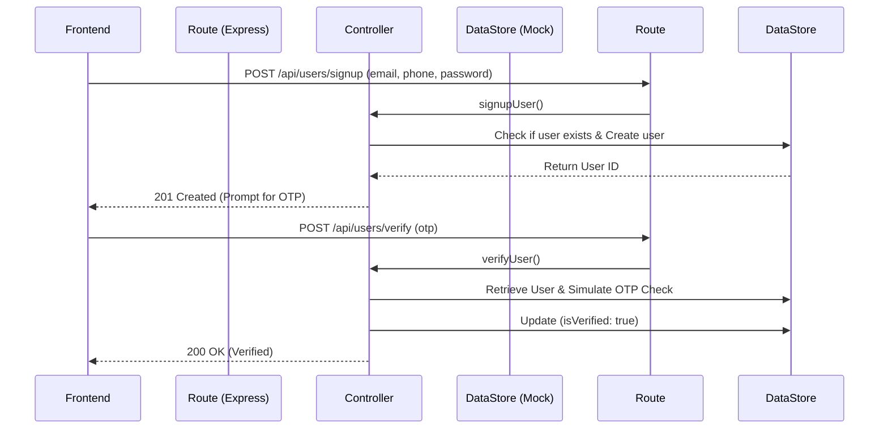
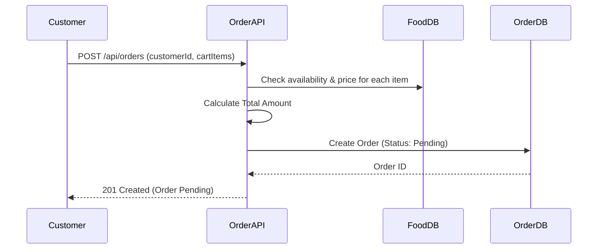
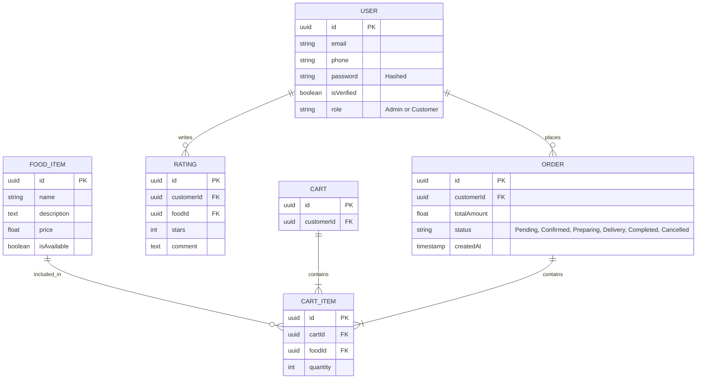

# Chuks Kitchen - Backend
A Backend API and System Design for the Chuks Kitchen food ordering platform.

## 1. System Overview
This project is a conceptually designed and partially implemented backend service for the Chuks Kitchen digital food ordering platform. The system facilitates customer interactions such as registering for an account, browsing available food items, adding items to a cart, placing orders, and tracking order statuses. Behind the scenes, the API leverages Node.js (Express) with an in-memory data store for simplified testing and immediate usability.

**How Frontend Communicates with Backend**
Conceptually, the frontend (e.g., React or React Native app) communicates with this backend via RESTful HTTP APIs. 
- **Requests:** The frontend sends HTTP requests (GET, POST) containing JSON payloads (like form data or cart items) and necessary headers (e.g., `Content-Type: application/json`).
- **Responses:** The backend processes the logic and returns HTTP status codes (like `200 OK`, `201 Created`, or `400 Bad Request`) along with a structured JSON response containing the requested data or error messages.

**Implemented APIs**
To fulfill the deliverable, the following 3 API groups (totaling 6 endpoints) were implemented:
1. **Option A (User API):** `POST /api/users/signup` and `POST /api/users/verify`
2. **Option B (Food/Menu API):** `GET /api/foods` and `POST /api/foods`
3. **Option C (Order API):** `POST /api/orders` and `GET /api/orders/:id`

## 2. Environment Setup & Running the Project

### Prerequisites
- [Node.js](https://nodejs.org/) (v16 or higher)
- npm (Node Package Manager)

### Dependencies Used
- **express**: Fast, unopinionated, minimalist web framework for routing.
- **cors**: Middleware to allow Cross-Origin Resource Sharing.
- **dotenv**: Loads environment variables from a `.env` file into `process.env`.
- **uuid**: Generates unique identifiers for users, foods, and orders.
- **nodemon** (Dev Dependency): Automatically restarts the node application when file changes in the directory are detected.

### Installation & Execution Steps

1. **Clone the repository or extract the ZIP file**
   ```bash
   git clone https://github.com/noahdevelopsio/Chuks-Kitchen-Backend.git
   cd Chuks-Kitchen-Backend
   ```

2. **Install dependencies**
   ```bash
   npm install
   ```

3. **Start the development server**
   ```bash
   npm run dev
   ```

4. **Test the API**
   The server will run on `http://localhost:3000`. You can test the endpoints using Postman, Insomnia, or cURL. For example:
   ```bash
   curl -X GET http://localhost:3000/api/foods
   ```

## 2. Backend Flow Diagrams

### User Registration & Access Flow
This diagram illustrates the process of a new user signing up, potentially providing a referral code, and then verifying their account via an OTP.



#### Flow Explanation (Step-by-Step)
1. The user submits their email, phone, and password through the frontend.
2. The `/api/users/signup` route checks if the user exists. If so, a 400 error is returned. If not, the user is saved with `isVerified: false`.
3. The API returns a `201 Created` status, prompting the frontend to ask for an OTP.
4. The user submits the OTP to `/api/users/verify`.
5. The API validates the code. If valid, `isVerified` becomes true, enabling full access.

#### Data Required for Screen
- **Inputs Expected:** `email` (or `phone`), `password`, `otp` (for verification step), and optionally `referralCode`.
- **Returned Data:** `userId`, success/error messages, and a verification token upon success.

### Ordering Flow Explanation
The ordering flow handles validating cart items against current database availability and prices before finalizing a pending order.



#### Flow Explanation (Step-by-Step)
1. The frontend gathers the user's cart items and ID and sends a `POST` request to `/api/orders`.
2. The backend loops through every cart item and checks the database to ensure the food `isAvailable` and prices match.
3. If any item is unavailable, a `400 Bad Request` error stops the transaction, preventing incorrect payments.
4. If valid, the backend calculates the final `totalAmount` itself (never trusting frontend prices) and creates the order as `Pending`.

#### Data Required for Screen
- **Inputs Expected:** `customerId` and an array of `items` (which include `foodId` and `quantity`).
- **Returned Data:** `orderId`, backend-calculated `totalAmount`, and order `status`.

## 3. Data Modeling (ERD)



## 4. Edge Case Handling
- **User abandons signup midway:** In a real SQL database, unverified accounts might fall into a `cron` job cleanup script that prunes accounts unverified after 24 hours.
- **Invalid/Expired OTP or Referral Code:** Return standard 400 Bad Request errors prompting the user on the frontend to resend the code.
- **Duplicate Registration:** The system queries `email` and `phone` before insertion. `400 Bad Request` is thrown immediately if they exist.
- **Food becomes unavailable after adding to cart:** The `POST /api/orders` route strictly validates `isAvailable` status for *every* item in the request against the current internal state *before* assigning a total price and creating the order.

## 5. Assumptions
- **Authentication**: For the scope of this deliverable, JWT token generation, password hashing (bcrypt), and robust session states are omitted in favor of structural flow logic.
- **Datastore**: An in-memory data structure is used to allow reviewers to run the API without installing or configuring external databases (like MongoDB or PostgreSQL).
- **Payment Processing**: Assumed to be handled externally (e.g., Paystack/Flutterwave webhook), meaning the order is created as `Pending` until a hypothetical payment webhook transitions it to `Confirmed`.

## 6. Scalability Thoughts (100 -> 10,000+ Users)
As user traffic grows from 100 to 10,000+:
1. **Database Migration**: The in-memory store must be replaced with a relational DB (PostgreSQL) for transactional integrity (ACID) ensuring race conditions don't ruin food stock quantities, or MongoDB if menus change rapidly geographically.
2. **Caching**: Utilize Redis to cache the `GET /api/foods` route since the menu is read-heavy and rarely changes compared to order creation.
3. **Microservices / Background Workers**: Sending emails (OTPs) and processing order status updates should be detached from the main Express event loop using message queues (RabbitMQ or AWS SQS) to prevent blocking incoming user requests.
